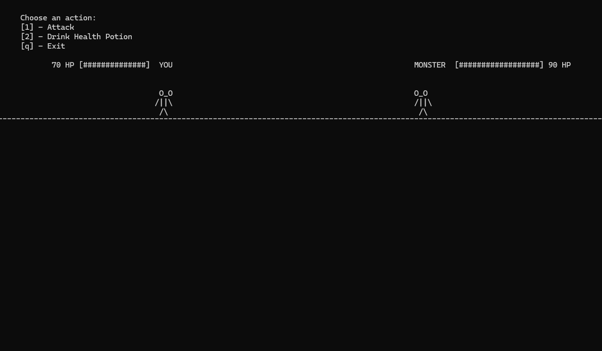
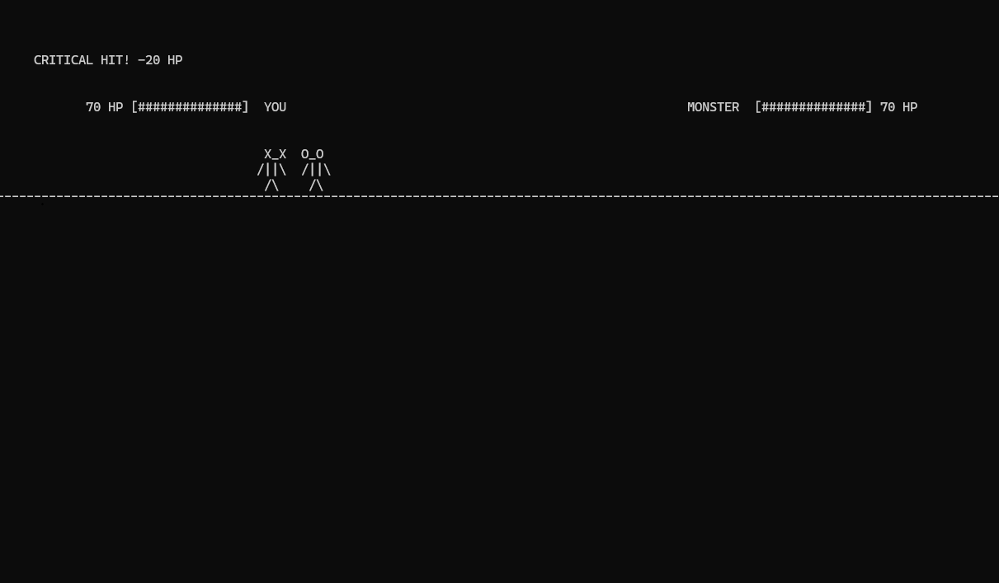
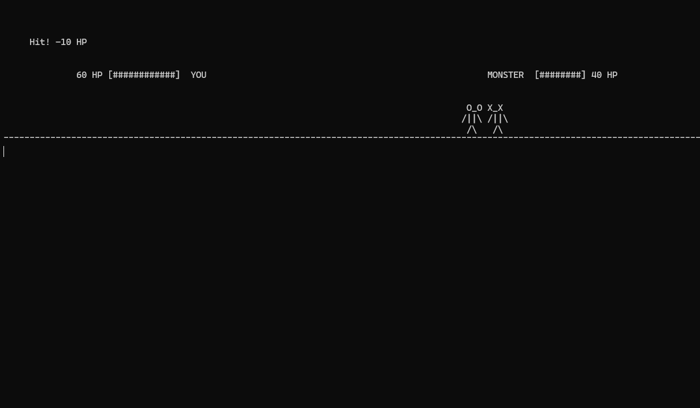

# PVP Console Game (C++)

A turn-based PvP fighting game in the terminal. You fight a monster — step by step, hit by hit, until one of you falls.

## Controls

- `1` — Attack
- `2` — Drink Health Potion
- `q` — Exit

## Features

- Turn-based combat: player attacks, then monster responds
- Critical hits (33% chance) — deal double damage
- Health Potion — restores 5, 10, 15 or 20 HP
- Animated movement: fighter walks toward the enemy, attacks, returns to start position
- Visual HP bars for both fighters
- Eyes change to `X_X` after taking damage
- Win/lose conditions based on HP

## Rules

- Base attack damage: **10 HP**
- Critical hit damage: **20 HP** (33% chance)
- Health Potion heals: **5, 10, 15 or 20 HP** (random)
- Both fighters start with **100 HP**
- Fight ends when one fighter's HP reaches 0

## Getting Started

Requires Linux/macOS (or WSL on Windows) with `g++`.

```bash
g++ main.cpp -o pvp
./pvp
```

## Screenshot





## Author

[Welgy](https://github.com/Welgy)
